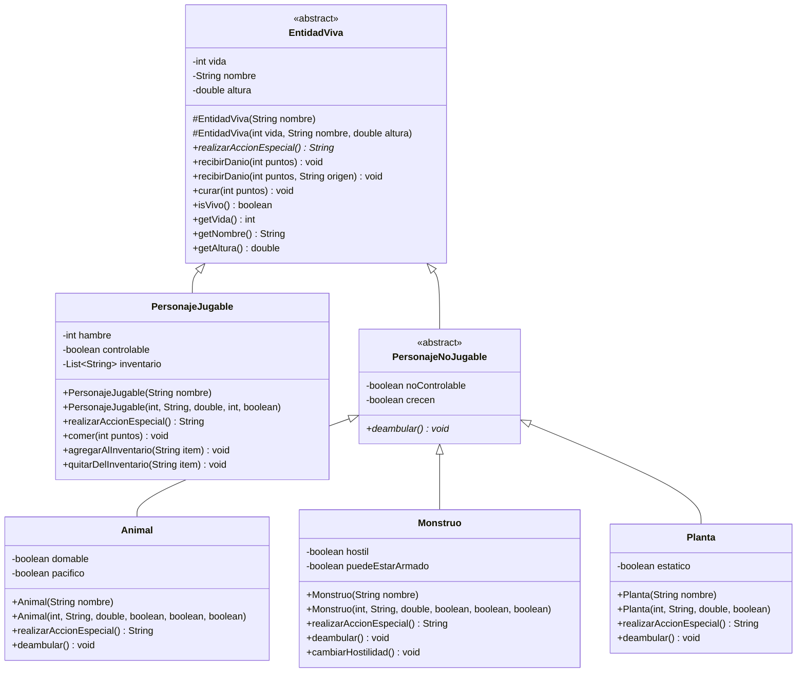

## Diagrama de Clases (Dominio)



## Sobrecarga y sobreescritura

**Sobrecarga** (misma clase, mismo nombre, otra lista de argumentos):
- `EntidadViva.recibirDanio(int)` y `EntidadViva.recibirDanio(int, String)`: la segunda indica el origen del daño y lo guarda en `ultimoOrigenDanio`.
- Constructores simples (solo `nombre`) y completos en `EntidadViva`, `PersonajeNoJugable`, `PersonajeJugable`, `Animal`, `Monstruo` y `Planta`. Las clases hijas llaman a `super(...)` y todos los constructores validan, así que el objeto nunca queda en estado ilegal.

**Sobreescritura** (misma firma en la clase hija, otra implementación):
- `EntidadViva.realizarAccionEspecial()` es abstracto. `Animal`, `Monstruo`, `Planta` y `PersonajeJugable` lo implementan, cada uno con su texto.
- `PersonajeNoJugable.deambular()` es abstracto y lo sobreescriben `Animal`, `Monstruo` y `Planta`.

**Cómo se distinguen:** la sobrecarga ocurre dentro de una misma clase y cambia la lista de argumentos. La sobreescritura ocurre entre padre e hija y mantiene la misma firma.

## Cómo probar

```bash
./mvnw spring-boot:run
```

| URL | Qué demuestra |
|---|---|
| `GET /` | El servicio está vivo |
| `GET /minecraft/acciones` | Sobreescritura: JSON de `Animal` y `Monstruo` vía tipo padre |
| `GET /minecraft/crear-jugador?nombre=Alex&vida=15` | Constructor completo desde la URL |
| `GET /minecraft/crear-jugador?vida=-5` | La clase rechaza el valor (HTTP 400) |
| `GET /minecraft/crear-monstruo?nombre=Zombie` | Constructor simple |
| `GET /minecraft/danio?puntos=5` | Sobrecarga: `recibirDanio(int)` |
| `GET /minecraft/danio?puntos=5&origen=flecha` | Sobrecarga: `recibirDanio(int, String)` |
